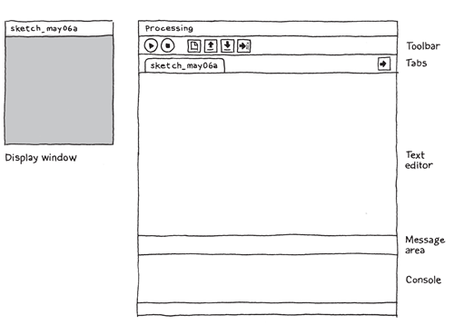
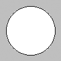

Welcome to Processing! Start by visiting [http://processing.org/download](http://processing.org/download) and selecting the Mac, Windows, or Linux version, depending on what machine you have. Installation on each machine is straightforward:

<ul>
    <li>On Windows, you'll have a .zip file. Double-click it, and drag the folder inside
        to a location on your hard disk. It could be Program Files or simply
        the desktop, but the important thing is for the processing folder to be
        pulled out of that .zip file. Then double-click processing.exe to start.</li>

    <li>The Mac OS X version is also a .zip file. Double-click it and drag the Processing
        icon to the Applications folder. If you're using someone else's machine
        and can't modify the Applications folder, just drag the application to the
        desktop. Then double-click the Processing icon to start.</li>

    <li>The Linux version is a .tar.gz file, which should be familiar to most Linux
        users. Download the file to your home directory, then open a terminal
        window, and type: 
        <tt>tar xvfz processing-xxxx.tgz</tt> 
        (Replace xxxx with the rest of the file's name, which is the version
        number.) This will create a folder named processing-2.0 or something
        similar. Then change to that directory: 
        <tt>cd processing-xxxx</tt> 
        and run it: 
        <tt>./processing</tt></li>
</ul>

With any luck, the main Processing window will now be visible. Everyone's setup is different, so if the program didn't start, or you're otherwise stuck, visit the [troubleshooting page](https://github.com/processing/processing/wiki/Troubleshooting) for possible solutions.

## Your First Program

You're now running the Processing Development Environment (or PDE). There's not much to it; the large area is the Text Editor, and there's a row of buttons across the top; this is the toolbar. Below the editor is the Message Area, and below that is the Console. The Message Area is used for one line messages, and the Console is used for more technical details.

In the editor, type the following:

    ellipse(50, 50, 80, 80)

This line of code means "draw an ellipse, with the center 50 pixels over from the left and 50 pixels down from the top, with a width and height of 80 pixels." Click the Run button the (triangle button in the Toolbar).

If you've typed everything correctly, you'll see a circle on your screen.

If you didn't type it correctly, the Message Area will turn red and complain about an error. If this happens, make sure that you've copied the example code exactly: the numbers should be contained within parentheses and have commas between each of them, and the line should end with a semicolon.

One of the most difficult things about getting started with programming is that you have to be very specific about the syntax. The Processing software isn't always smart enough to know what you mean, and can be quite fussy about the placement of punctuation. You'll get used to it with a little practice.

Next, we'll skip ahead to a sketch that's a little more exciting. Delete the text from the last example, and try this:

    settings <- function() {
        size(480, 120)
    }

    draw <- function() {
        if (mousePressedVar) {
            fill(0)
        } else {
            fill(255)
        }
        ellipse(mouseX, mouseY, 80, 80)
    }

This program creates a window that is 480 pixels wide and 120 pixels high, and then starts drawing white circles at the position of the mouse. When a mouse button is pressed, the circle color changes to black. We'll explain more about the elements of this program in detail later. For now, run the code, move the mouse, and click to see what it does. While the sketch is running, the Run button will change to a square “stop” icon, which you can click to halt the sketch.

## Show

If you don’t want to use the buttons, you can always use the Sketch menu, which reveals the shortcut Ctrl-R (or Cmd-R on the Mac) for Run. The Present option clears the rest of the screen when the program is run to present the sketch all by itself. You can also use Present from the Toolbar by holding down the Shift key as you click the Run button.

## Save and New

The next command that’s important is Save. You can find it under the File menu. By default, your programs are saved to the "sketchbook," which is a folder that collects your programs for easy access. Select the Sketchbook option in the File menu to bring up a list of all the sketches in your sketchbook.

It’s always a good idea to save your sketches often. As you try different things, keep saving with different names, so that you can always go back to an earlier version. This is especially helpful if—no, when—something breaks. You can also see where the sketch is located on your computer with the Show Sketch Folder command under the Sketch menu.

You can create a new sketch by selecting the New option from the File menu. This will create a new sketch in its own window

## Share

Processing sketches are made to be shared. The Export Application option in the File menu will bundle your code into a single folder. Export Application creates an application for your choice of Mac, Windows, and/or Linux. This is an easy way to make self-contained, double-clickable versions of your projects that can run full screen or in a window.

The application folders are erased and re-created each time you use the Export Application command, so be sure to move the folder elsewhere if you do not want it to be erased with the next export.

## Examples and Reference

Learning how to program involves exploring lots of code: running, altering, breaking, and enhancing it until you have reshaped it into something new. With this in mind, the Processing software download includes dozens of examples that demonstrate different features of the software.

To open an example, select Examples from the File menu and double-click an example's name to open it. The examples are grouped into categories based on their function, such as Form, Motion, and Image. Find an interesting topic in the list and try an example.

When looking at code in the editor, you'll see that functions like ellipse() and fill() have a different color from the rest of the text. If you see a function that you’re unfamiliar with, select the text, and then click "Find in Reference" from the Help menu. You can also right-click the text (or Ctrl-click on a Mac) and choose "Find in Reference" from the menu that appears. This will open a web browser and show the reference for that function. In addition, you can view the full documentation for the software by selecting Reference from the Help menu.

The Processing Reference explains every code element with a description and examples. The Reference programs are much shorter (usually four or five lines) and easier to follow than the longer code found in the Examples folder. We recommend keeping the Reference open while you’re reading this book and while you’re programming. It can be navigated by topic or alphabetically; sometimes it’s fastest to do a text search within your browser window.

The Reference was written with the beginner in mind; we hope that we’ve made it clear and understandable. We’re grateful to the many people who’ve spotted errors over the years and reported them. If you think you can improve a reference entry or you find a mistake, please let us know by clicking the link at the top of each reference page.
